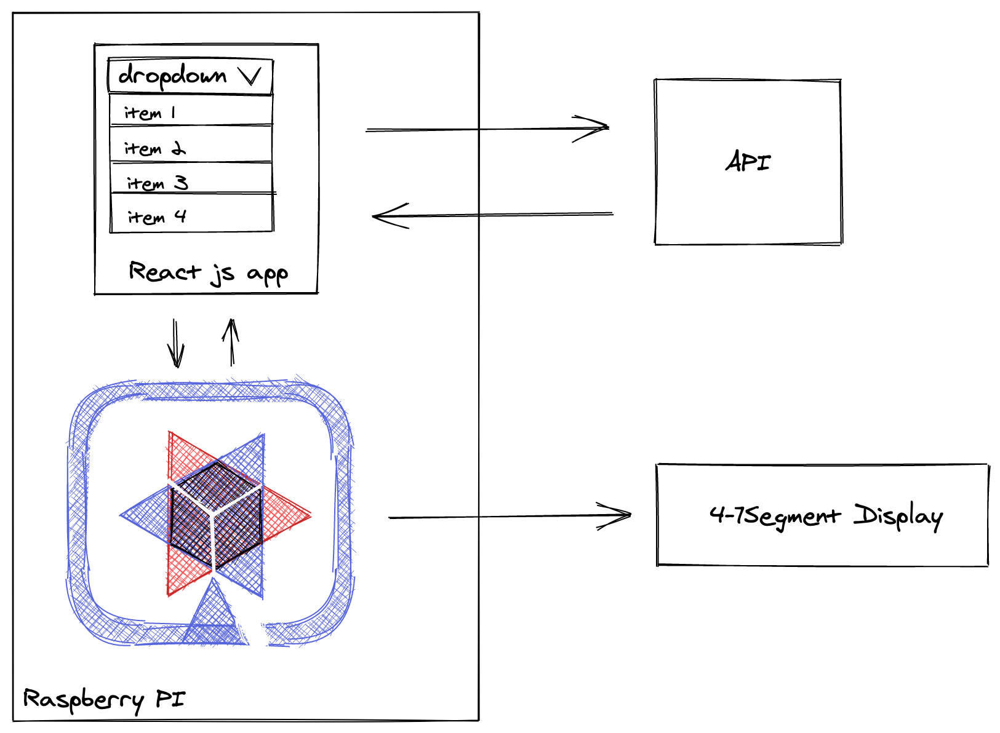

# timezone-quarkus47display

An application that reads available timezones from worldtimeapi.org and displays them in an autocomplete list. When a region is selected it calls the Qurakus REST API passing the current time and Quarkus set the time value on the segment display.


- [Front End React App ](https://github.com/elaineakemi/react-timezone)


### Deploy

```
mvn package -Dquarkus.package.uber-jar=true
```


# rum

```
java -jar target/quarkus47segments-0.0.1-SNAPSHOT-runner.jar
```




- [Blog post](http://www.igfasouza.com/blog)
